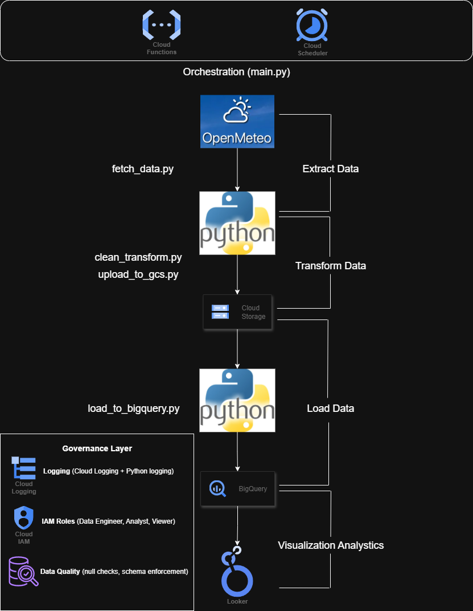
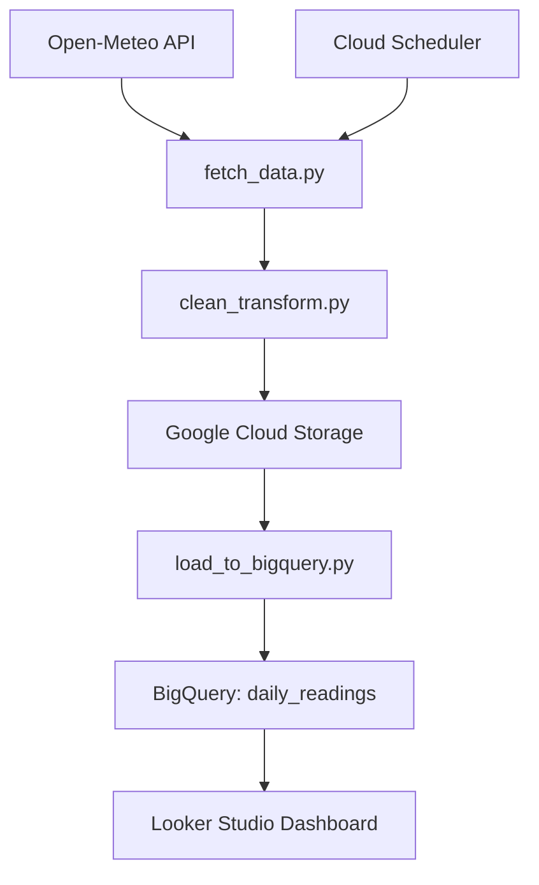
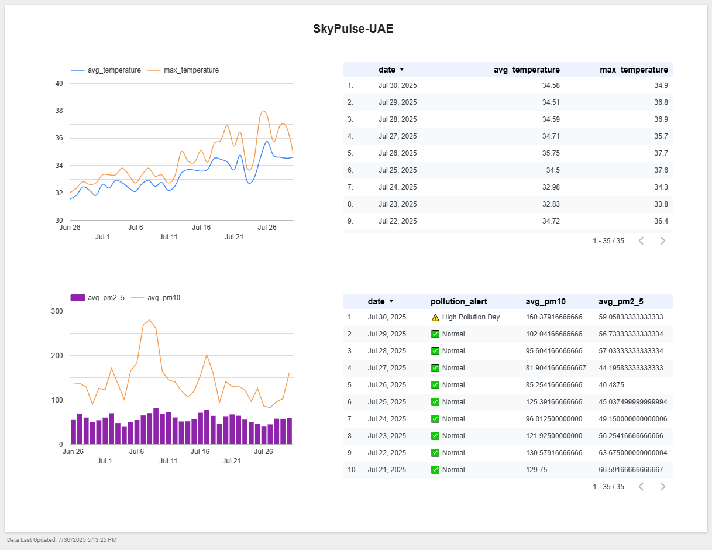

# 🌍 SkyPulse UAE

**Real-Time Weather & Air Quality Data Pipeline (GCP Free-Tier Project)**



## 📌 Overview

SkyPulse UAE is a serverless data engineering pipeline that fetches **hourly weather and air quality data** for the UAE from the [Open-Meteo API](https://open-meteo.com/), processes it, and stores it in **Google Cloud Platform (GCP)** for analysis and visualization.
This project is designed as a **portfolio-ready data engineering solution** built entirely within GCP’s free tier.

---

## ⚙️ Tools & Technologies

* **Programming:** Python (`requests`, `pandas`, `logging`)
* **Cloud Platform:** Google Cloud Platform
* **Data Storage:** Google Cloud Storage (GCS)
* **Data Warehouse:** BigQuery
* **Workflow Orchestration:** Cloud Scheduler + Cloud Functions
* **Dashboarding:** Looker Studio
* **Version Control:** GitHub

---

## 📂 Project Architecture



---

## 📊 Features

* ✅ **Automated daily ingestion** of UAE weather & air quality data
* ✅ **Data cleaning & validation** (null checks, type enforcement, deduplication)
* ✅ **Daily CSV snapshots** stored in Google Cloud Storage
* ✅ **BigQuery integration** for scalable querying and analytics
* ✅ **Scheduled orchestration** via Cloud Scheduler + Cloud Functions
* ✅ **Interactive Looker Studio Dashboard** with daily pollution alerts & trends

---

## 🚀 Setup Instructions

### 1️⃣ Clone the Repository

```bash
git clone https://github.com/adambenhalid/skypulse-uae.git
cd skypulse-uae
```

### 2️⃣ Install Dependencies

```bash
pip install -r requirements.txt
```

### 3️⃣ Configure GCP Credentials

* Create a GCP Service Account JSON key
* Save it as `gcs-key.json` in the root folder (not pushed to GitHub)
* Authenticate locally:

```bash
export GOOGLE_APPLICATION_CREDENTIALS="gcs-key.json"
```

### 4️⃣ Run the Pipeline Locally

```bash
python main.py
```

---

## 🗄️ BigQuery Schema

| Column                 | Type      | Description                             |
| ---------------------- | --------- | --------------------------------------- |
| timestamp              | TIMESTAMP | Hourly UTC timestamp (Dubai TZ applied) |
| temperature\_2m        | FLOAT     | 2m above ground temperature (°C)        |
| apparent\_temperature  | FLOAT     | Feels-like temperature (°C)             |
| relative\_humidity\_2m | FLOAT     | Humidity (%)                            |
| pm10                   | FLOAT     | Particulate matter ≤10 µm (µg/m³)       |
| pm2\_5                 | FLOAT     | Particulate matter ≤2.5 µm (µg/m³)      |
| date                   | DATE      | Observation date                        |

---

## 📈 Example Dashboard (Looker Studio)


*Interactive Looker Studio dashboard displaying temperature & pollution trends across the UAE.*

---

## 🔒 Data Governance

| Aspect         | Implementation                                       |
| -------------- | ---------------------------------------------------- |
| Data Quality   | Null checks, schema enforcement, deduplication       |
| Access Control | IAM roles for Data Engineer, Analyst, Viewer         |
| Logging        | Python logging & Cloud Logging                       |
| Retention      | GCS lifecycle rules (optional cleanup after 30 days) |

---

## 🧑‍💻 Author

**Adam Benhalid**
Data Engineer | Abu Dhabi, UAE
📧 [adambenhalid@gmail.com](mailto:adambenhalid@gmail.com)

